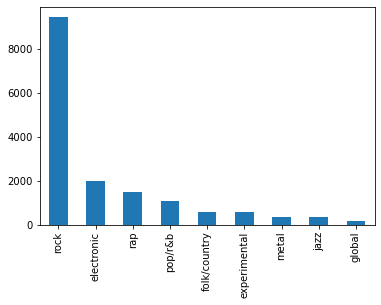

# Introduction

In this project two clustering methods will be compared and evaluated on a text dataset.

# Dataset

The dataset consists of album reviews of various music albums from the Pitchfork website. @dataset_pitchfork

## Preprocessing

In order to use the dataset some preprocessing steps were taken:

1. remove the \\xa0 symbol
   When loading the csv file the xa0 whitespace symbol appeared as text and it had to be removed
2. remove symbols
   Removes all the symbols that are not alphanumeric or whitespaces, along with the dash ('-') and underscore ('\_')
3. stemming
   This removes all the suffixes and prefixes of the words. There are multiple stemming algorithms, and the Snowball Stemmer was used in this case.

For a better result, lemmatization could have been used for the last step. This was the initial idea but was replaced with stemming due to the fact that the lemmatization of a entry (i.e. a review of an album) took too long, and considering the fact that the dataset contains 18k rows, it's not a feasible solution.

For the final preprocessing step, the whole dataset was processed using the TF-IDF algorithm.

Due to the unbalanced nature of the dataset. See the figure below.

In order to compensate for that the majority classes were down sampled.

Out of all the initial 9 classes, 4 most popular have been used. This was done by sampling trough the classes and keeping only some of the apparitions (i.e. max(rows, upper_limit)) and upper limit was set on some of them.

# Methods

In order to have a better overview of the performance of the clustering algorithms, a supervised method was used and also the probability of choosing at random were computed

## Kmeans

Because the number of clusters it is known, we just set it as a parameter to function and train the algorithm on the data.

## DBSCAN

## PCA and TSNE

In order to test multiple hypothesis, the data was also reduced in dimensions using the PCA and t-SNE, down to two components.

In some of the cases it greatly improved the outcome, especially for the DBSCAN algorithm.

# Evaluation and Results

In order to evaluate the models, a simple function that compares the true labels with the predicted labels is not enough as the label assignment is random by the clustering algorithms. Therefore, multiple metrics have been used:

- Completeness Score
- Homogeneity Score
- Silhouette Score
- Accuracy
   As stated previously the labels cannot be simply compared, but this problem can be overcome. By permutating the columns of the confusion matrix in order to obtain the maximum value on the main diagonal. This permutation process is quite consuming and it's replaced by the Hungarian algorithm @cluster_accuracy @coclust

| Method            | Accuracy | Completeness | Homogeneity | Silhouette |
| ---               | ---      | ---          | ---         | ---        |
| Random prediction | 11.1%    |           |          |         |
| RandomForest      | 62%      |           |          |         |
|                |       |           |          |         |
| Kmeans            | 62%      | 62%          | 62%         | 62%        |
| - PCA             | 62%      | 62%          | 62%         | 62%        |
| - t-SNE           | 62%      | 62%          | 62%         | 62%        |
|                |       |           |          |         |
| DBSCAN            |          |              |             |            |
| - PCA             | 62%      | 62%          | 62%         | 62%        |
| - t-SNE           | 62%      | 62%          | 62%         | 62%        |

Completeness Score:	 0.03688
homogeneity Score:	 0.00588
Accuracy:	 0.58135
Silhouette Score:	 0.38084

Completeness Score:	 0.01014
homogeneity Score:	 0.01459
Accuracy:	 0.20616
Silhouette Score:	 0.3235599994659424

Completeness Score:	 0.01746
homogeneity Score:	 0.01273
Accuracy:	 0.48036
Silhouette Score:	 0.69976

dbscan
Completeness Score:	 0.06172
homogeneity Score:	 0.09467
Accuracy:	 0.42553
Silhouette Score:	 0.05347000062465668

Completeness Score:	 0.00847
homogeneity Score:	 0.00494
Accuracy:	 0.47492
Silhouette Score:	 0.43861

# Conclusion

# References
